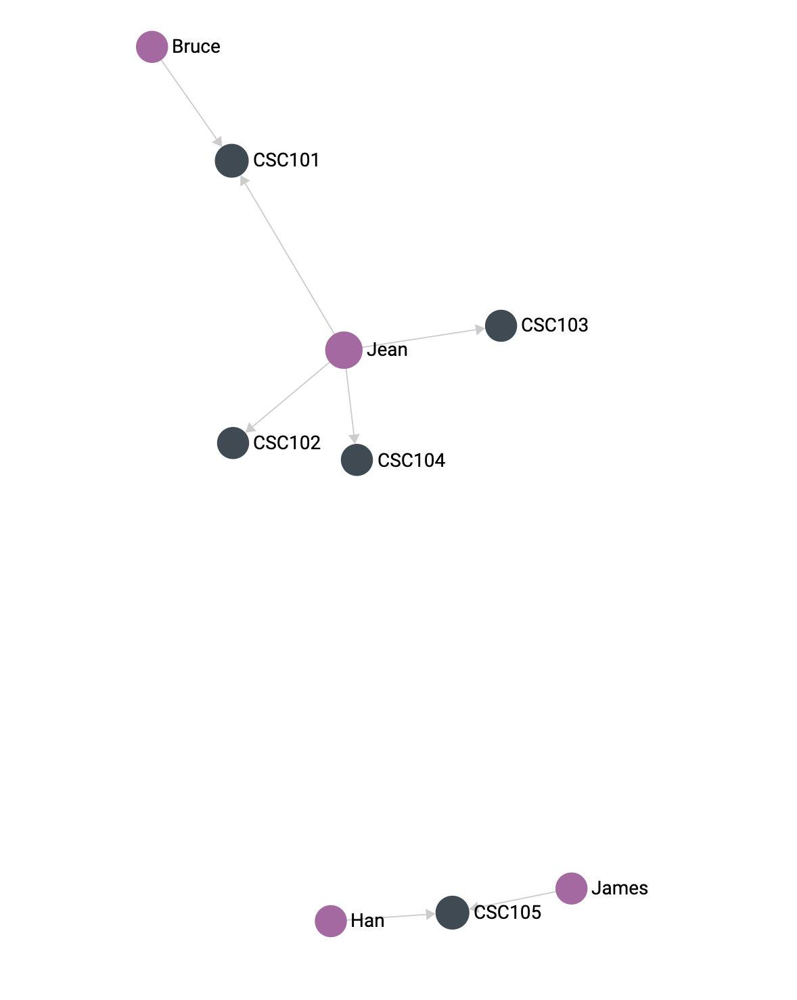
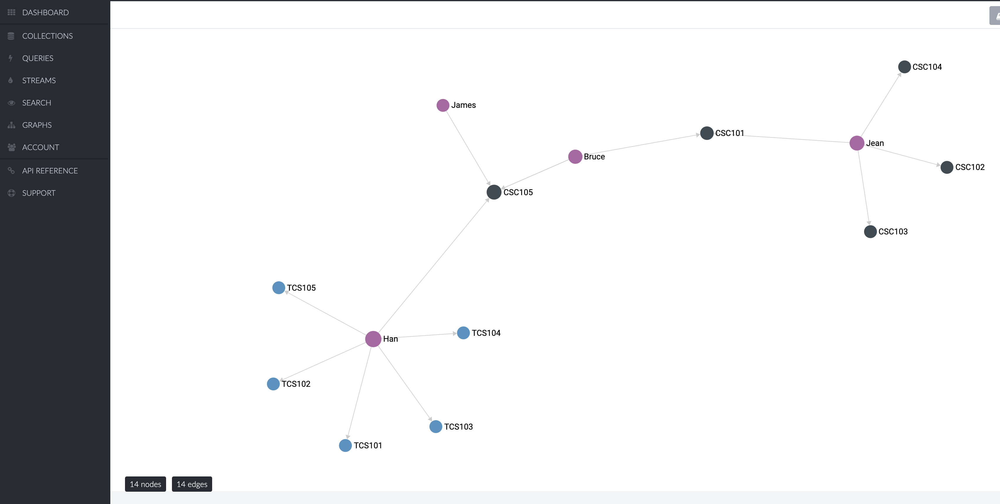

# goC8

Welcome to the GitHub page for goC8, a Golang client for the macrometa global data platform (GDN).

## About

[Macrometa](https://www.macrometa.com/) is a secure, global data platform with integrated pub/sub, stream processing,
search, functions, and 4 databases all through one single API. GDN clients for [Python](https://github.com/Macrometacorp/pyC8), [Java](https://github.com/Macrometacorp/c84j), and [Javascript](https://github.com/Macrometacorp/jsC8) are available from [Macrometa](https://github.com/Macrometacorp).
goC8 is an open source client that implements the Macrometa API for Golang. 

## Use cases

* Legal compliance with [data residency regulations](https://incountry.com/blog/data-residency-laws-by-country-overview/) & [EU GDPR regulations](https://www.omnitas.se/data-residency-affected-by-gdpr-and-schrems/)
* Global data to cluster co-location for low latency data access
* [Web Assembly (WASM) storage](https://itnext.io/webassemply-with-golang-by-scratch-e05ec5230558)
* Unified single storage API 
* Microservice storage
* Kubernetes storage
* Mobile app storage 
* Single, globally distributed & fail-safe, storage backend shared between web, mobile, & cluster applications
* Event storage & streaming for real-time data analytics wth real-time client updates

## Install

```Bash
go get github.com/marvin-hansen/goC8/client
```

## Authentication

Currently, only API key authentication is supported.

## Configuration

If you have not worked with macrometa's plattform before, you have to do a one-time setup. See this [guide](doc/setup.md)
for details about creating a data fabric for your project.

The client config requires the following settings:

* Api Key
* Endpoint
* Fabric
* Timeout

Api Key refers to the generated api access key. Endpoint refers to the POP provided by the GDN. Fabric refers to the GDN
Geo Fabric. Timeout refers to the http connection timeout in seconds. If you do not have these value at hand, please read the [setup guide](doc/setup.md) for details.

## Code examples

### API 
* Collections [code example](examples/api/collections/main.go) and [tests](tests/collection/collection_test.go)
* Documents [code example](examples/api/documentstore/main.go) and [tests](tests/document)
* Graph [code example](examples/api/graph/main.go) and [tests](tests/graph/graph_test.go)
* Index [code example](examples/api/index/main.go) and [tests](tests/index/index_test.go)
* KeyValue [code example](examples/api/kv/main.go) and [tests](tests/kv/kv_test.go)
* Query [code example](examples/flight/main.go) and [tests](tests/query/query_test.go)

### Examples 
* [Flight example](examples/flight/main.go)
* [University example](examples/university/main.go)

Golang demo apps from Macrometa
* [Salesforce PII](https://github.com/Macrometacorp/demo-salesforce-pii)
* [Data privacy and residency](https://github.com/Macrometacorp/demo-pii)


## Usage: Graph, collection, & document API

Full code in [Flight example](examples/flight/main.go)

```Go
package main

import (
	"log"
	"github.com/marvin-hansen/goC8"
	"github.com/marvin-hansen/goC8/examples/sample_data"
	"github.com/marvin-hansen/goC8/tests/utils"
)

const (
	// client config
	apiKey   = "email.root.secretkey.xxxxxxxxxxxxxxxxx"
	endpoint = "https://YOUR-ID-us-west.paas.macrometa.io"
	fabric   = "MyFabric"
	timeout  = 5 // http connection timeout in seconds 
	// collection, document & graph config
	delete           = false
	verbose          = true
	graph            = "airline"
	collectionID     = "cities"
	edgeCollectionID = "flights"
)

func main() {
	println("Create new config ")
	config := goC8.NewConfig(apiKey, endpoint, fabric, timeout)

	println("Create new client with config ")
	c := goC8.NewClient(config)
	
	println("Setup: Create Graph, collections & import data")
	setup(c)

	println("Query: Document & Graph")
	query(c)

	if delete {
		println("Teardown: Delete Graph & Data")
		teardown(c)
	}
}

func query(c *goC8.Client) {
	var q = ""
	var msg = ""

	q = sample_data.GetAllCitiesQuery()
	msg = "Get all cities."
	runQuery(c, q, msg)

	q = sample_data.GetBreadthFirstQuery()
	msg = "Get all cities with a direct flight to New York."
	runQuery(c, q, msg)

	q = sample_data.GetShortestPathQuery()
	msg = "Get the shortest path from San Francisco to Paris."
	runQuery(c, q, msg)

	q = sample_data.GetShortestDistanceQuery()
	msg = "Get the distance on the shortest path from San Francisco to Paris."
	runQuery(c, q, msg)

	q = sample_data.GetNearestCities()
	msg = "Get the 2 nearest cities to a specified latitude and longitude."
	runQuery(c, q, msg)

	q = sample_data.GetCitiesMaxDistance()
	msg = "Get the cities that are no more than 2500km away from houston."
	runQuery(c, q, msg)
}

func runQuery(c *goC8.Client, q, msg string) {
	println(msg)
	res, err := c.Query(fabric, q, nil, nil)
	goC8.CheckError(err, "Error Query: "+q)
	goC8.PrintQuery(res, verbose)
}

// setup & teardown use the built-in utilities to create collection, index, graph & import data.
func setup(c *goC8.Client) {
	goC8.CreateCollection(c, fabric, collectionID, types.DocumentCollectionType, false)
	field := "location" // We have to create a geo index with geoJson enabled on field location before importing data
	goC8.CreateIndex(c, fabric, collectionID, field, types.GeoIndex, true, true, true, true)
	goC8.ImportCollectionData(c, fabric, collectionID, sample_data.GetCityData(), silent)
	goC8.CreateCollection(c, fabric, edgeCollectionID, types.EdgeCollectionType, false)
	goC8.ImportCollectionData(c, fabric, edgeCollectionID, sample_data.GetFlightData(), silent)
	goC8.CreateGraph(c, fabric, graph, sample_data.GetAirlineGraph())
}

func teardown(c *goC8.Client) {
	goC8.TeardownGraph(c, fabric, graph, true)
	goC8.TeardownCollection(c, fabric, collectionID)
	goC8.TeardownCollection(c, fabric, edgeCollectionID)
}
```


## Usage: Updating graph structure & data 

Suppose you have a university graph in which teachers hold multiple lectures and 
some lectures are given by two or more teachers. In total, the graph consists of three collections:

1) Lectures
2) Teachers
3) "teach" edge that connects teachers to lectures 

After all collections have been created and sample data have been imported,
the graph console shows the following result:

.

We see that Jean seems to be busy teaching multiple classes, while Jams & Han co-teach one of the advanced courses. 
After the initial success, the Dean's office asks you "to do the same for tutorials".

In this university, some tutorials are given by junior teachers who also co-teach lectures.
That means, we need two new types, one vertex type for tutorials, and a second edge type that
connects teachers to tutorials. That way, a teacher may give one or more lectures, but also may 
give one or more tutorials. 


To add the tutorials to the university graph two new collections, tutorials & tutors. To do so, we take a look at the test case
from the graph [API test suite](tests/graph/graph_test.go). 

Essentially, the test does three steps to update the graph:

1) Test if a collection exists
   - If not, create a new collection
   - If so, test if the collection already is in the graph
2) Import or add data if available
3) Add the (new) collection to the graph


```Go
func TestAddEdgeCollection(t *testing.T) {
	c := goC8.NewClient(config.GetDefaultConfig())

	// check if collection already exists
	exists, err := c.Collection.CheckCollectionExists(fabric, collectionTutorials)
	goC8.CheckError(err, "Error CheckCollectionExists: ")
	if !exists {
		// 1. if not create collection
		collType := types.DocumentCollectionType
		allowUserKeys := false
		err = c.Collection.CreateNewCollection(fabric, collectionTutorials, allowUserKeys, collType)
		assert.NoError(t, err)

		// 2. import data
		jsonDocument := sample_data.GetTutorialsData()
		_, err = c.Document.CreateNewDocument(fabric, collectionTutorials, silent, jsonDocument, nil)
		assert.NoError(t, err)

		// 3. Add vertex collection to graph
		_, err = c.Graph.AddVertexCollection(fabric, graphName, collectionTutorials)
		assert.NoError(t, err)
	}

	// check if collection already exists
	exists, err = c.Collection.CheckCollectionExists(fabric, edgeCollectionTutors)
	goC8.CheckError(err, "Error CheckCollectionExists")
	if !exists {
		// 1. if not create edge collection
		collType := types.EdgeCollectionType
		err = c.Collection.CreateNewCollection(fabric, edgeCollectionTutors, false, collType)
		assert.NoError(t, err)

		// 2. import data
		jsonDocument := sample_data.GetTutorsEdgeData()
		_, err = c.Document.CreateNewDocument(fabric, edgeCollectionTutors, silent, jsonDocument, nil)
		assert.NoError(t, err)

		// 3. add edge collection to graph
		collectionName := edgeCollectionTutors
		sourceVertex := "teachers"
		destinationVertex := "tutorials"

		res, createErr := c.Graph.AddEdgeCollection(fabric, graphName, collectionName, sourceVertex, destinationVertex)
		assert.NoError(t, createErr)
		assert.NotNil(t, res)
		goC8.PrintRes(res, verbose)
	}
}
```

After the tutorial system was implemented, it became obvious that Han already handles five tutorials in addition to teaching CS105.
The dean's office decided to add Bruce as a third co-teacher to CS105 to ensure quality of teaching does not suffer. 
To add the new edge, from teacher Bruce to lecture CS105, you check if the edge already exsits and just call the API method CreateEdge()
as shown below. 

There are two ways to call CreateEdge()
1) With a custom Json payload, as shown in the example
2) By providing from / to, which in the example are left as empty strings. When using this, jsonPayload must be nil.  

The difference is as following:
1) Using a custom payload allows for custom attributes i.e. "online" and custom primary keys set in the _key field.
2) Just setting from/to fields means no custom attributes are possible and primary keys will be generated by the system. 

The first scenario allows rich edges but requires custom primary key management. As shown in the example, just generating 
the key from the primary keys of the from/to collection should be sufficient to sustain unique primary keys.
The second scenario helps with bulk inserts of basic relations in which the key isn't of interest. 

```Go
func TestAddEdge(t *testing.T) {
   c := goC8.NewClient(config.GetDefaultConfig())
   collectionID := "teach"
   edgeID := "Bruce-CSC105"
   returnNew := false
   
   // check if edge already exits
   exists, err := c.Graph.CheckEdgeExists(fabric, graphName, collectionID, edgeID)
   goC8.CheckError(err, "Error CheckEdgeExists")
   if !exists {
   // if not, add a new edge to the edge collection
   jsonPayload := []byte(`{
               "_key": "Bruce-CSC105",
               "_from": "teachers/Bruce",
               "_to": "lectures/CSC105",
               "online": false
           }`)
   _, createErr := c.Graph.CreateEdge(fabric, graphName, collectionID, "", "", jsonPayload, returnNew)
   assert.NoError(t, createErr)
   }
}

```

Take a look at the graph console to see how nicely teachers are linked to lectures and tutorials. 

.

With the university graph in place, it is relatively simple to add basic resource planning i.e. 
linking courses to lecture halls and tutorial to seminar rooms or add some queries similar to the one in the flight example.

It is worth mentioning that edges may contain arbitrary attributes so you can add additional information to filter edges
during query time. In the university examples, each "teach" edge contains a boolean flag indicating if that lecture is
held online. Additional information can be added i.e. the term the lecture is usually scheduled or the maximum 
number of allowed students to support capacity planning during enrollment. During query time, one can filter
these attributes i.e. find all lectures on campus (online=false) with enrollment at 90% or more of capacity.  
Or, in an attempt to validate the last annual staff review: Find all teachers with the lowest enrollment grouped by 
class difficulty and seek a conversation with whoever comes up. 


## Make reference

```bash 
Setup: 
    make check                  Checks all requirements.
 
Test: 
    make test-all               Runs all API tests.
    make test-collection        Tests collection API. 
    make test-document          Tests document API. 
    make test-index             Tests index API. 
    make test-kv                Tests key-value API. 
```

## Known issues and solutions

### Illegal key while creating ....

This error means that the provided key, name, or identifier in question does not adhere to the established convention.
Names for collections, documents, graphs, and edges follow the same convention as keys,
there is a high chance that the identifier contains a blank or non-allowed character triggering this error.
When writing insert functions with custom primary keys, it is paramount to stick to the [naming convention](doc/README_KEYS.md)
to prevent runtime errors.

For details, please look at the

* [key naming convention](doc/README_KEYS.md)
* [Official Arango Docs](https://www.arangodb.com/docs/stable/data-modeling-naming-conventions-document-keys.html)
* [Stack Overflow](https://stackoverflow.com/questions/68118693/arangodb-illegal-document-key-error-while-creating-graph)

Notice, the problem in the Stack Overflow question was the blank in the graph name.
A fix would be eliminating the blank by renaming the graph from "Friends visit" to "FriendsVisit" to adhere to the naming convention.

### VPackError error: Expecting digit

Error number 400 / 600 

This error means that the provided JSON doesn't conform to the standard. 

Use a JSON [validator](https://jsonformatter.curiousconcept.com/) and check for common issues:

* Missing comma between array values
* Comma after last attribute
* Singe quote ' instead of double " quote

Notice, the JSON unpacker is rather fragile so whatever "small fixes" the validator suggests, 
apply them otherwise the error persists. 

## Author

* Marvin Hansen
* GPG key ID: 210D39BC
* Github key ID: 369D5A0B210D39BC
* GPG Fingerprint: 4B18 F7B2 04B9 7A72 967E 663E 369D 5A0B 210D 39BC
* Public key: [key](pubkey.txt)

## Licence

* [MIT Licence](LICENSE)
* Software is "as is" without any warranty. 
